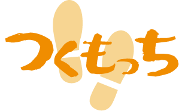

# つくもっち

# 作品概要
2023年度（3年次）ゼミ活動  
### 開発目的（テーマ）  
「歩く」を「遊びのちから」で「ぜひやりたい」にする
### ジャンル  
AR位置情報ゲーム
### 開発期間  
企画立案2023/4/19～  
開発開始2023/6/28～2024/1/24
### チーム構成（計5名）  
プランナー2名/プログラマー2名/デザイナー1名  
### 開発環境  
Unity2021.3.9f1  
VisualStudio2022  
GitHub  
VisualStudioCode

# プレイ動画
## 実演動画（約10分）
- スタートからクリアまでの一連の流れを収めた動画です。
https://drive.google.com/file/d/1uKCRuuXMA7LjjxFrmJ5maiWYRRe-rN5r/view?usp=sharing